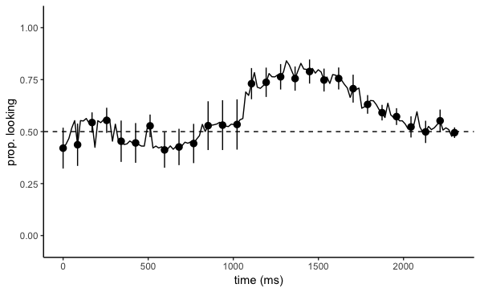
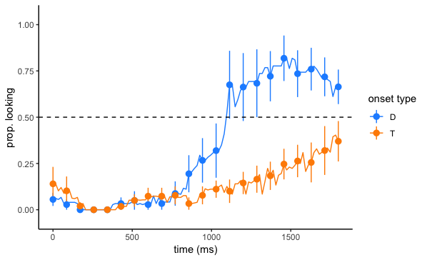

# iChartAnalyzeR

`iChartAnalyzeR` is a R-package that contains utility functions for
analyzing eyetracking studies in the style of the
Language Learning Lab at Stanford University.

⚠️ Warning: This package is early work in development and subject to potentially code-breaking changes.

## Setup

### Install iChartAnalyzeR

Install `iChartAnalyzeR` from this GitHub repository:

```r
install.packages('devtools')
devtools::install_github("kemacdonald/iChartAnalyzeR")
```

## Usage

The following code snippet shows how to use the basic functionality of `iChartAnalyzeR`.
Note that for any of these functions to work, the data have to be in iChart format with the same column naming conventions.

```r
library(iChartAnalyzeR)

## Set the working directory to wherever the iChart is stored on your local machine or server
setwd("~/Desktop/tobii_to_ichart_test/test_Rscripts/")

## Read and Preprocess iChart
d <- readiChart(iChartFile = "Habla2_25_iChart_wide.txt", sampling_rate = 17)
d <- computeStatistics(d, cleanWindowStart = 0, cleanWindowEnd = 2300,
                       accuracyWindowStart = 300, accuracyWindowEnd = 1800,
                       save_results = TRUE)
d <- filteriChart(d, minRT = 300, maxRT = 1800, maxfirstgap = 15, maxlonggap = 15, save_results = TRUE)
d <- defineOnset(d, critonset = 0, includeAways = FALSE)

## Describe the iChart
describeiChart(d)

## Filter out Prescreened Trials
d_analysis <- filterPrescreened(d, save_results = TRUE)
describeiChart(d_analysis)

## Rename condition
d_analysis <- renameCondition(d_analysis, oldCondition = "Experimental", newCondition = "Vanilla")
describeiChart(d_analysis)

## Filter out unknown words
d_analysis <- removeUnknownWords(d_analysis, knownWords_file = "knows.txt", knows_threshold = 3)
describeiChart(d_analysis)

## Compute aggregate accuracy and RT
acc <- poolData(d_analysis,
               dependent="Accuracy",
               include_T_initial = TRUE,
               RejectFirstGap=TRUE,
               RejectLongestGap=TRUE,
               RejectRT=FALSE,
               save_results = TRUE)

rt <- poolData(d_analysis,
              dependent = "RT",
              include_T_initial = TRUE,
              RejectFirstGap = TRUE,
              RejectLongestGap = TRUE,
              RejectRT = TRUE,
              save_results = TRUE)

## Generate and save graph values for Profile Plot
pp_gvs <- generatePPgraphValues(d_analysis,
                                filter_criteria = list('GoodFirstGap', 'GoodLongestGap'),
                                group_cols = list("Condition"),
                                gvStartWindow = 0, gvEndWindow = 3000,
                                save_results = F)

## Make a Profile Plot from the graph values
makeProfilePlot(pp_gvs, plotStartWindow = 0, plotEndWindow = 2300, smoothing_factor = 5,
                save_results = TRUE)
                
```



```r

## Generate and save graph values for Onset Contingency Plot
oc_gvs <- generateOCgraphValues(d_analysis,
                                filter_criteria = list('GoodFirstGap', 'GoodLongestGap'),
                                group_cols = list("Condition"),
                                gvStartWindow = 0, gvEndWindow = 3000,
                                save_results = TRUE)

## Make Onset Contingency Plot
makeOCplot(oc_gvs, plotStartWindow = 0, plotEndWindow = 1800, smoothing_factor = 5,
           save_results = TRUE)
```



